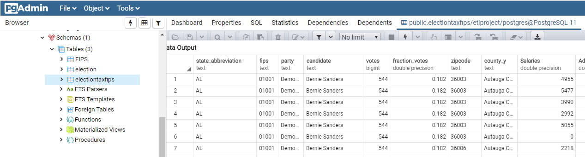

# ETLProject | Vote - Tax - FIPS
ETL Project | Richard Harris | Brian Labelle

## Background
HarLabs has been tasked with merging data sources from the 2016 Primary Election results with 2014 Salary / Wages.
We used a 3rd data source to merge on the zipcode based on the US County FIPS. FIPS (Federal Information Processing Standards) are a set of standards that describe document processing, encryption algorithms and other information technology standards for use within non-military government agencies and by government contractors and vendors who work with the agencies.

## Technology

In order for us to complete this customer request we utilized:
   - Python
   - Jupyter NoteBooks
   - Postgres
   - Microsoft Excel
   - CSV files
   - Umbrello ( Postgres ER Diagram )
   
## Data Sources
  - kaggle: ( 2016 Primary Election Results, 2014 Individual Income Tax Statistics & )

  
# Instructions
1. pull down the entire GitHub Project
2. connect to your postgres database and create a database called etlproject and run the SQL in the SQL folder of the project to create the FIPS union table ( sql-postgres-fips-table.sql )
3. swap out the default postgres credentials in the Jupyter Notebook called ETL-Project.ipynb
4. run the Jupyter Notebook file
5. make sure you also update your default postgres credentials in the final cell which will...
	a. create a connection to postgres
	b. create a table called electiontaxfips in your connected database, if exist, it replaces it.
	c. creates a output csv file which is then imported into the postgres database.
	

_________________________________________________________________________________

## Submission

https://https://github.com/BrianLabelle/ETL-Project

- - -

© 2019 Rice Cookers | HarLabs | Richard Harris - Brian Labelle | Sous-Coding Chefs
